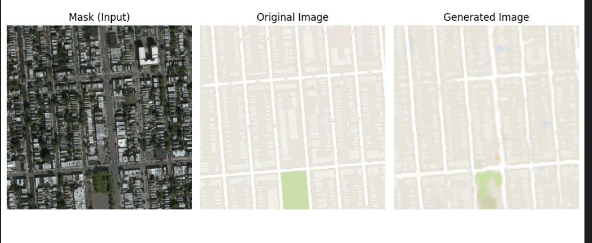

# Pix2Pix for Google Maps  
**Paired Image-to-Image Translation Using Conditional GANs**

## 📌 Introduction  

Pix2Pix is a conditional Generative Adversarial Network (cGAN) designed for **image-to-image translation** tasks where paired data is available. The model uses an **Autoencoder-like structure** for the generator, which learns to map images from one domain to another.

In this specific application, Pix2Pix is used to translate satellite images into simplified **map views** — turning real-world aerial photos into cartographic-style maps using learned pixel-to-pixel mappings.

---

## 💻 Project Application  

The main goal of this project is:  
> _To convert realistic satellite images into clear, map-like visuals by training on paired datasets using the Pix2Pix architecture._

This approach enables urban planning tools, autonomous navigation, and GIS systems to automate the transformation of satellite data into useful map formats.

---

## 🖼️ Results  

Below is an example output of the Pix2Pix model converting a satellite image into a map view:

### Example Output:
  

---

## 🙌 Acknowledgments  

This project is inspired by the original [Pix2Pix paper](https://arxiv.org/abs/1611.07004) and adapted for paired translation tasks in the satellite-to-map domain.
